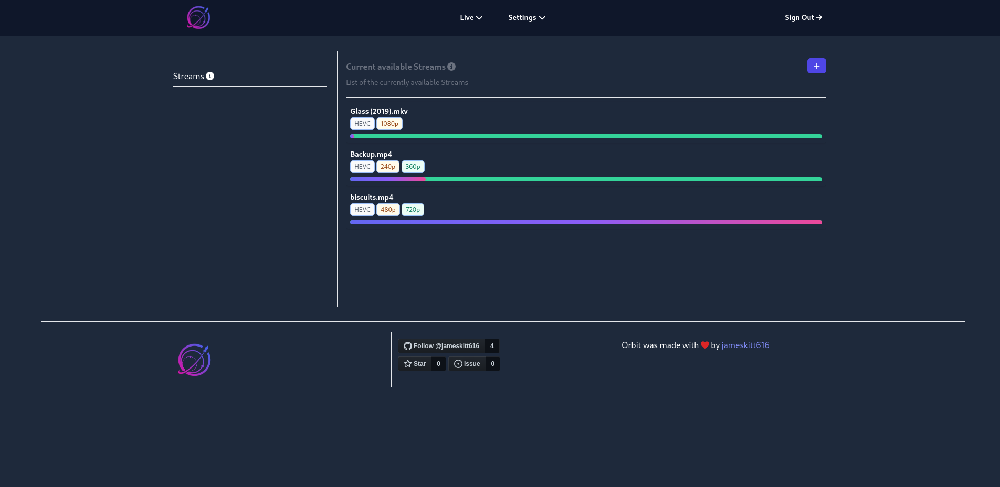
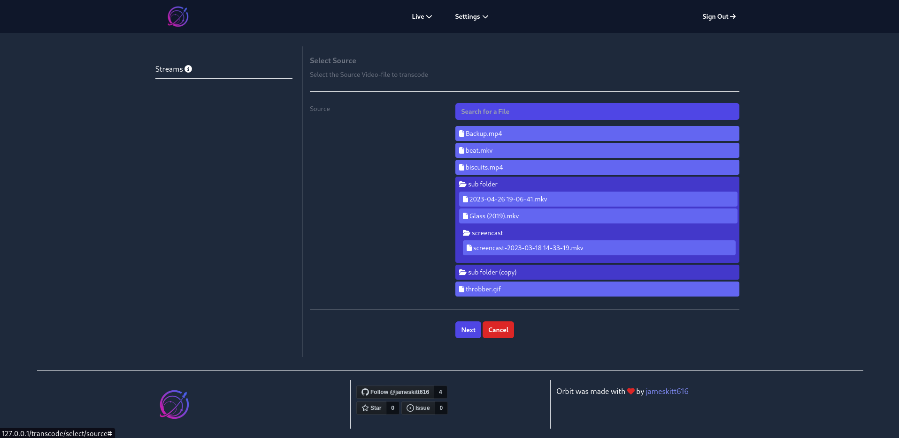
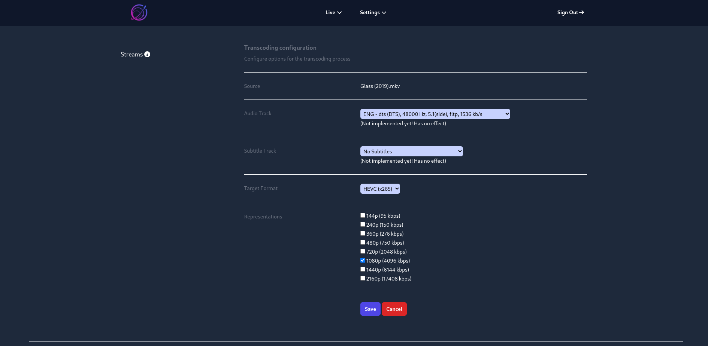
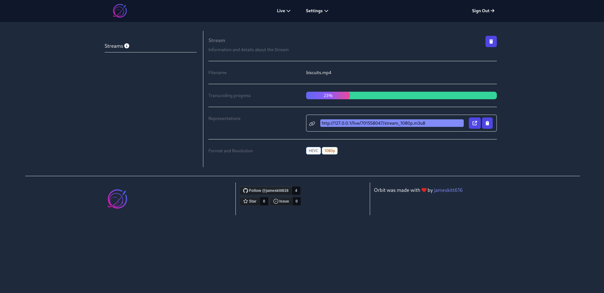

# Orbit

A [Docker](https://www.docker.com/) and [PHP](https://www.php.net/)-[Symfony](https://symfony.com) based application,
using [FFmpeg](https://ffmpeg.org/) and [Mediamtx](https://github.com/bluenviron/mediamtx) to live stream video files
via [RTSP](https://en.wikipedia.org/wiki/Real_Time_Streaming_Protocol).

# Contents

- [Project description](#project-description)
- [Installation](#installation)
- [Updating](#updating)
- [Features](#features)
- [Planned Features](#planned-features)
- [Screenshots](#screenshots)
- [License](#license)
- [Credits and Special Thanks](#credits)

# Project description

The objective of this project is to develop an optimized video transcoding and streaming system. This system will be
capable of handling video files of different formats and sizes, converting them into a specific format, and generating
rtsp streams to facilitate seamless internet streaming.

The system has been designed to allow concurrent processing of multiple video files. It utilizes a combination of
open-source tools and custom scripts to handle the transcoding processes efficiently.

The workflow of the system begins with users uploading video files to a designated server directory. In the future, this
process can be accomplished through a user-friendly web interface. Users can browse the uploaded files and select the
ones they want to transcode. An interactive form is available to guide users through the selection of the file, desired
video qualities, audio track, and format. Upon submitting the form, a rtsp stream will be generated automatically.

To facilitate management of the transcoding and streaming process, the system provides a user-friendly web-based
interface. Additionally, users can access various settings to customize their experience.

In summary, the goal of this project is to deliver an efficient solution for transcoding and streaming video files.

# Installation

1. If not already done, [install Docker and Docker Compose (v2.10+)](https://docs.docker.com/engine/install/)
2. Copy and configure your docker compose
   file `curl -L -o docker-compose.yml https://raw.githubusercontent.com/jameskitt616/orbit/main/docker-compose.prod.yml`
3. Update the passwords and storage paths in the docker compose file
4. Run `docker compose up` (the logs will be displayed in the current shell)
5. Open `http://localhost` or `http://<ip-of-your-server>` in your favorite web browser (make sure to properly configure
   the firewall of your server)
6. Run `docker compose up -d` to run the Docker containers in detached daemon mode
7. The firewall needs to be configured as follows: Open Port `8554` to be able to access RTSP streams. Optionally open
   Port `80` in case you don't use a reverse proxy.
8. Don't forget to set up some reverse proxy (just like Caddy or Nginx) with SSL/TLS Certificates

# Updating

> **_NOTE:_** Please remember to periodically check
> the [Docker Compose file](https://raw.githubusercontent.com/jameskitt616/orbit/main/docker-compose.prod.yml) or the
> README of this project for any changes. This is especially important if you encounter issues after an update.

1. Run `docker compose pull && docker compose up -d && docker image prune -f`

> **_NOTE:_** `docker image prune -f` removes unused Docker images from your local machine. The -f flag forces the
> deletion without confirmation prompts.

# Features

* Quick and seamless initiation of video transcoding and streaming with just a few clicks.
* Automatic generation of shareable links for easy content access.
* Support for multiple users, allowing simultaneous access and utilization of the system.
* A user interface (UI) designed with a focus on simplicity and ease of use.

**Enjoy!**

## Planned Features

- [x] Select Audio Tracks
- [ ] Select Subtitles
- [ ] Enabling users to upload video files through a user-friendly web interface (Web-UI).
- [ ] Optimizing the system for mobile view and enabling installation via Browser Web Progressive App (WPA).
- [x] Offering the ability to configure custom representations, specifying bitrate and quality settings.
- [ ] Enabling the ability to start streaming from a specific timestamp.
- [ ] Provide a method to download a video file from a given URL.

Generally, this project is still under development, and there will be ongoing work on various smaller fixes, features,
and updates, which may not be explicitly mentioned above.

## Known Bugs

- [ ] When not using "Original Representation" and the video's aspect ratio is not 16:9. The output might be stretched.
- [ ] Progress calculation might do nothing.
- [ ] Storage calculation in settings might display wrong Format

# Screenshots

# License

Orbit is available under the MIT License.

# Credits

Created by [jameskitt616](https://jameskitt616.one/).

### Special thanks to:

* [Symfony](https://github.com/symfony/symfony)
* [symfony-docker](https://github.com/dunglas/symfony-docker)
* [PHP-FFmpeg-video-streaming](https://github.com/hadronepoch/PHP-FFmpeg-video-streaming)
* [jsTree](https://github.com/vakata/jstree)
* [FFmpeg](https://ffmpeg.org)
* [tailwindcss](https://tailwindcss.com/)
* [Font Awesome](https://fontawesome.com/)
* [Mediamtx](https://github.com/bluenviron/mediamtx)
